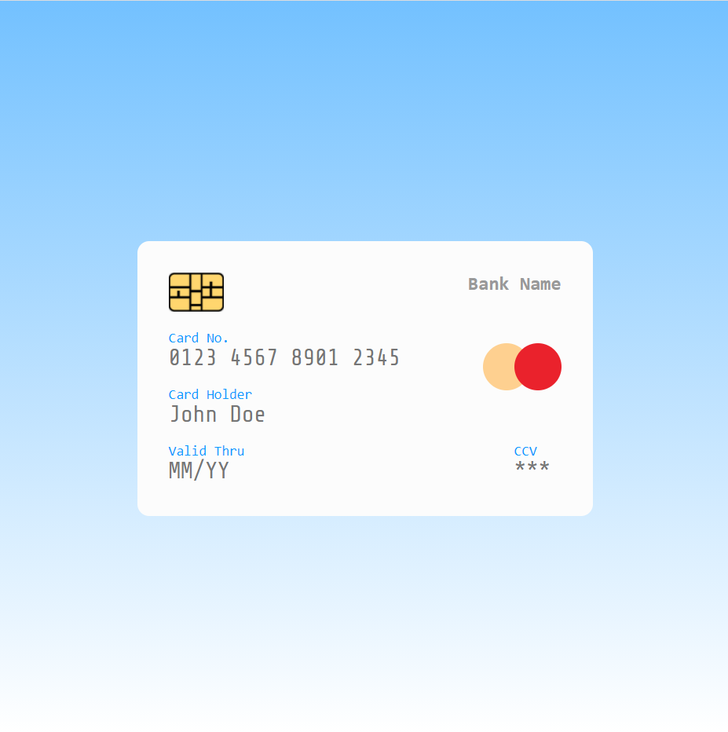

   

<h1 align="center"> Sobre o Projeto 👨🏻‍💻</h1>

<h4 align="center">Pagina para e-commerce, checkout de pagamento no Cartão</h4>

 

Índice 
<a href="#-sobre-o-projeto-">Sobre</a> •
<a href="#Imagem">Imagem</a> •
<a href="#Tecnologias-">Tecnologias</a> •
<a href="#Ferramentas">Ferramentas</a>

 

<h2 align="center">Imagem</h2>

<h1 align="center">
   
</h1>

  ### Tecnologias 🚀

  As seguintes ferramentas foram usadas na construção do projeto:

  - [x] **HTML**
  - [x] **CSS**
  - [x] **JS**

  #### Ferramentas

  - [**VS CODE**](https://code.visualstudio.com/)

 
  <h1 align="center">Siga-me</h1>
  
Made with 💜 by FELIPE HOLANDA 👋🏻  [See my Linkedin](https://www.linkedin.com/in/felipe-holanda-de-freitas-3a91281a2/)

